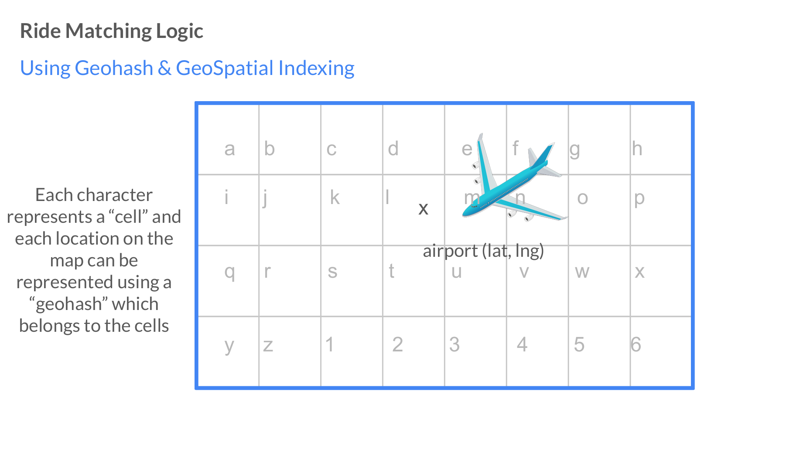
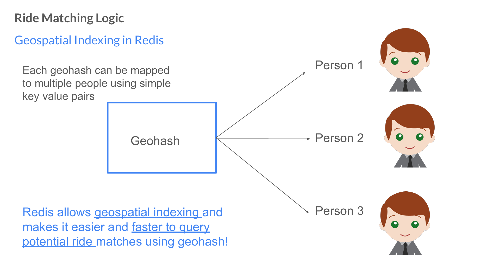
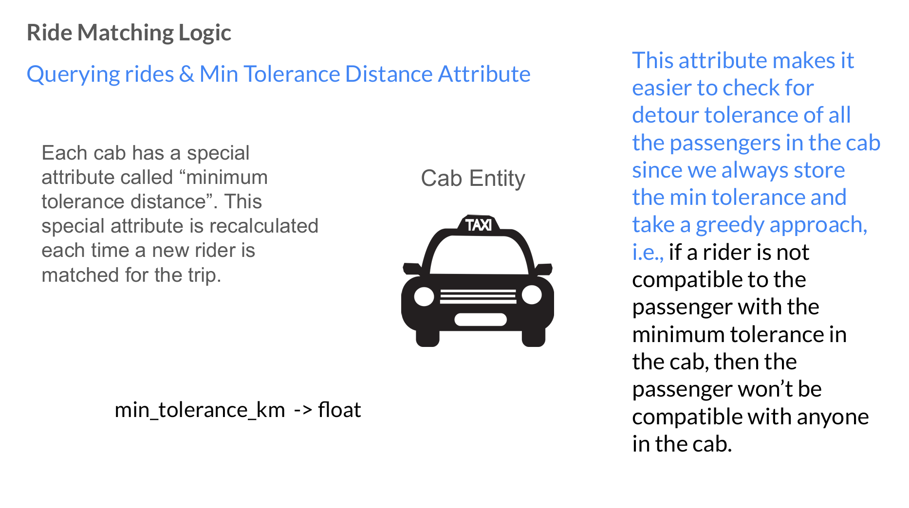
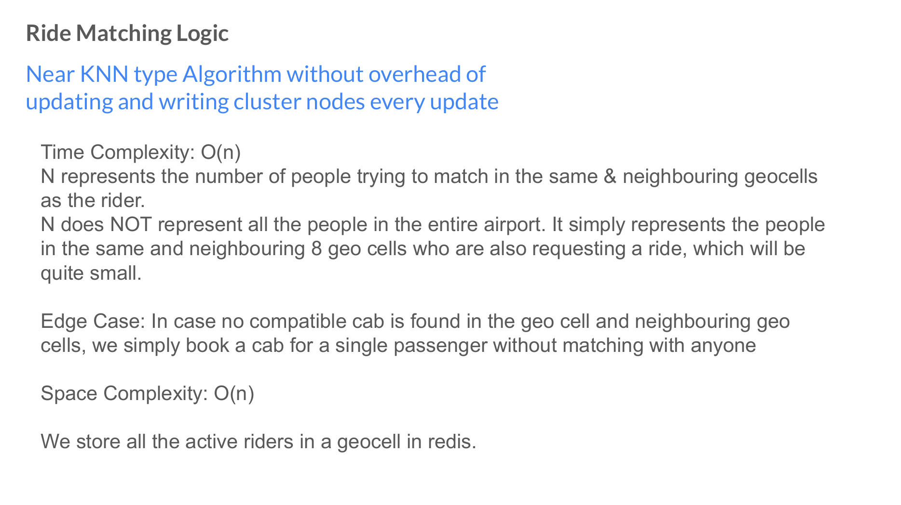

# Ride Sharing System

powered by geohash & geospatial indexing provided by redis & golang worker pool

# Architecture Overview
https://excalidraw.com/#json=_qJcyO3x9C_Oe9gp2KnE_,rMweYx-wltCiSE8PMT8exg

# Ride Matching Algorithm Overview








## Techstack
- Golang (backend)
- RabbitMQ (buffer queue for worker pool)
- Redis (for faster lookup without network overhead)
- Postgres Database (for persistent storage)
- Typescript (frontend)

## Usage
Configure database setting in .env using .env.example

Ensure that redis and rabbit mq are running on the following port. Pull docker image and run their instances.
```
redis at localhost:6379
rabbit mq at localhost:5672
```
then run
```
cd backend
go build cmd/api/main.go
go run ./main

```

# Directory Structure
This project follows modular architecture to ensure sepearation of concerns.

```text
backend/
├── cmd/                               # Application entry points
│   ├── api/                           # REST + WebSocket API server
│   │   └── main.go                    # Bootstraps HTTP server, router, dependencies
│   └── worker/                        # Background worker process
│       └── main.go                    # Bootstraps worker, connects to Redis & RabbitMQ
│
├── internal/                          # Private application code
│   ├── api/
│   │   └── rest/
│   │       ├── handlers/              # HTTP / WebSocket handlers
│   │       │   └── ride_handler.go    # Ride request, WS handling, polling logic
│   │       ├── middleware/            # HTTP middlewares (auth, logging, etc.)
│   │       ├── request/               # Request DTOs
│   │       │   └── ride_request.go
│   │       ├── response/              # Response DTOs
│   │       └── router/                # Route registration
│   │           ├── router.go
│   │           └── ride_routes.go
│   │
│   ├── config/                        # Configuration loading (env, configs)
│   │
│   ├── domain/
│   │   └── ride/                      # Core ride domain (business logic)
│   │       ├── model.go               # Domain models (Rider, Cab, Fare, etc.)
│   │       ├── repository.go          # Repository interfaces (ports)
│   │       └── service.go             # Domain services (RequestRide, CalculateFare, etc.)
│   │
│   ├── infrastructure/
│   │   ├── database/
│   │   │   └── postgres/
│   │   │       └── repositories/      # PostgreSQL implementations of repositories
│   │   │           └── ride_repository.go
│   │   └── migration/                 # Database migrations
│   │       └── 000001_rider.sql
│   │
│   ├── queue/                         # Message queue abstraction (RabbitMQ)
│   │   ├── queue.go                   # Queue connection & setup
│   │   └── service.go                 # Publisher helpers
│   │
│   └── worker/                        # Background workers
│       └── ride_matching_worker.go    # Ride matching logic (Redis + Lua + MQ)
│
├── go.mod
└── go.sum
```
a minimal dashboard :

